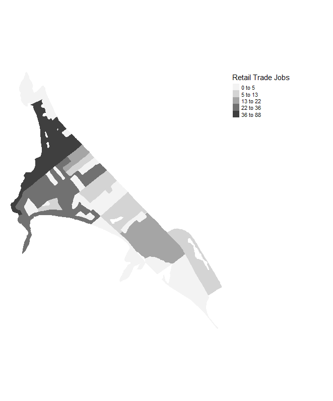
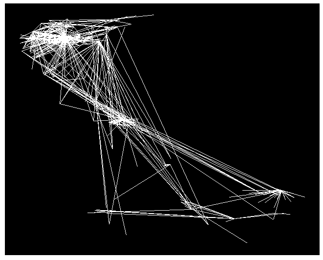
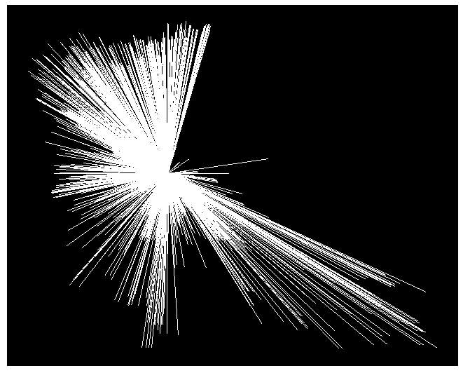

## README for tidylodes

Welcome to tidylodes! 

An R package for extracting, processing and 'spatialising' data from the US Census Bureau's LODES database

## 1. LODES Introduction 

LEHD Origin-Destination Employment Statistics or **LODES** is a dataset made available by the Longitudinal Employer-Household Dynamics (LEHD) program, part of the Centre for Economic Studies at the U.S. Census Bureau. This package uses Version 7 of LODES which has been enumerated by the 2010 Census Blocks.

The database contains three different datasets:
  
  1. **Workplace Area Characteristics (WAC)** - Total and sector-specific job estimates at census block level for census blocks classified as 'workplace areas.' The data set does not contain data for every census block, only those classified as workplace areas.
  
  2. **Residence Area Characteristics (RAC)** - Total and sector-specific job estimates at census block level for census blocks classified as 'residence areas.' The dataset does not contain data for every census block, only those classified as residence areas.
  
  3. **Origin-Destination Job Flows (OD)** - Estimated job flows at census block level, from residence areas to workplace areas. The dataset only includes flows of greater than or equal to 1. 
  

## 2. Package Description: 

*tidylodes* enables users to extract datasets directly from LODES at: https://lehd.ces.census.gov/data/lodes/. 

Users of the package can download WAC, RAC and OD datasets for specific states and for specific years, directly to their PC for use locally.

The package cleans the datasets and improves the recording of census geographies within them. The package also offers users the opportunity to convert these datasets into spatial formats for spatial exploration/manipulation/analysis. It is important to stress that the datasets downloaded with this package contain only information on workplace areas, residence areas or those with valid OD flows, thus not every census block is accounted for. 


## 3. Installation

```{r}
## Install package directly from GitHub
#devtools::install_github("patrickballantyne/tidylodes")
```

The package has a number of dependencies, please ensure you have a version of R equal to or greater than 3.5.0, and that you have each of the packages below installed, and at a version equal to or greater than those below:

| Package         | Version       | 
| ----------------|--------------:| 
| R.utils         | (>= 2.6.0)    | 
| data.table      | (>= 1.12.2)   |
| stringr         | (>= 1.4.0)    |
| dplyr           | (>= 0.8.5)    |
| tigris          | (>- 0.9.4)    |
| sf              | (>= 0.8.1)    |


## 4. Usage 

```{r setup}
## Setup
library(tidylodes)
```

Each dataset (WAC, RAC and OD) has its own set of functions that can be used to extract, manipulate and/or convert to a spatial format:

```{r}
## List all available functions
ls("package:tidylodes")
```

To view the help associated a tidylodes function type the following:

```{r}
# Get function help
?get_wac_data
```

### Function Examples

#### WAC / RAC Data

As an example, let's go through how to use the various functions specific to **WAC** data:

```{r}
## Extract WAC data for Delaware, from 2013
de_wac <- get_wac_data("de", "2013")
de_wac[1:2, ]
```

```{r}
## Reduce the dimensionality of de_wac to focus on one job sector - e.g. Retail Trade
de_wac_rt <- get_jobsector_wac(de_wac, job_code = "Retail_Trade",
                               job_proportion = T)
de_wac_rt[1:2, ]
```

```{r echo=TRUE, message=TRUE, warning=FALSE, results='hide', fig.keep='all'}
## Convert to simple features format
de_wac_rt_sf <- get_wac_spatial(de_wac_rt)
de_wac_rt_sf[1:2, ]
```


The **WAC** and **RAC** datasets have identical functions, so the above steps can be repeated to obtain LODES data for Residential Areas (RAC) by substituting the corresponding wac functions as below:

| Function Purpose                | WAC                   | RAC                 |
| --------------------------------|:---------------------:| -------------------:|
| Download full dataset           | *get_wac_data*        | *get_rac_data*      |
| Subset to specific job sector   | *get_jobsector_wac*   | *get_jobsector_rac* |
| Convert to spatial format       | *get_wac_spatial*     | *get_rac_spatial*   |

#### Origin-Destination (OD) Data

The **OD** datasets have different functions:

```{r}
## Download OD data for Delaware, from 2013
de_od <- get_od_data("de", "2013", main = T)
de_od[1:2, ]
```

```{r}
## Subset data to include only those rows of data where flows exceed a certain threshold
de_od_sub <- get_od_subset(de_od, flow_threshold = 30)
de_od_sub[1:2, ]
```

```{r warning=FALSE}
## Convert to a format that enables plotting of flow lines between census block centroids
de_od_sub_sp <- get_od_spatial(de_od_sub)
de_od_sub_sp[1:2, ]
```

## 5. Example Applications

**Plotting choropleths of WAC/RAC data**

```{r echo=FALSE, message=FALSE, warning=FALSE, results='hide', fig.keep='all'}
## Get RAC data for Vermont, from 2017 
vt_rac <- get_rac_data("vt", "2017")
## Convert to simple feature
vt_rac_sf <- get_rac_spatial(vt_rac)
```

These WAC/RAC datasets are large, and mapping these will take considerable time. However, the nature of converting WAC/RAC to sf means that they become easy to manipulate using the tidyverse (v. >= 1.3.0), so areas of particular interest can be selected (e.g. specific tracts), and then mapped using tmap (v. >= 2.2).

For more information on the packages used below, visit:

- **tidyverse** - https://www.tidyverse.org/
- **tmap** - https://cran.r-project.org/web/packages/tmap/ 

```{r message = FALSE, warning=FALSE }
#install.packages("tidyverse")
library(tidyverse)
#install.packages("tmap")
library(tmap)
## Subset dataset to specific County & Tract
area_of_interest <- vt_rac_sf %>%
  filter(CountyID == "007", TractID == "000200")
## Map 
tm_shape(area_of_interest) +
  tm_fill(col = "Retail_Trade", style = "jenks",
          title = "Retail Trade Jobs", palette = "Greys", n = 5) +
  tm_layout(legend.outside = T, frame = FALSE) 
```

  <p align="center">
  
</p>

**Plotting OD Flows**

The OD datasets are even larger than the WAC and RAC datasets, and mapping these will also take considerable time. To reduce the size of the OD dataset, the get_od_subset() function is used below to extract only job flows of 16 or above, and these are then mapped using ggplot. 

- For more information on ggplot() visit: https://cran.r-project.org/web/packages/ggplot2/index.html

```{r warning = FALSE}
## Get OD data for Delaware State
de_od <- get_od_data("de", "2014", T)
## Get subset (flows > 20)
de_od_sub <- get_od_subset(de_od, flow_threshold = 8)
## Convert to spatial, for mapping
de_od_sub_sp <- get_od_spatial(de_od_sub)
## Plot all flows for Delaware State over 10, using ggplot()
library(ggplot2)
ggplot(de_od_sub_sp) +
  geom_segment(aes(x = W_lat, y = W_lon, xend = R_lat, yend = R_lon), col = "white") +
  scale_alpha_continuous() +
  theme(panel.background = element_rect(fill='black', colour = 'black'), panel.grid.major = element_blank(),
        panel.grid.minor = element_blank(), axis.line = element_blank(), axis.text = element_blank(), 
        axis.title = element_blank(), axis.ticks = element_blank())
```


  <p align="center">
  
</p>

Another interesting use case of the OD datasets is in extracting and mapping flows of jobs for one workplace area. This lends itself to applications in various modelling strategies such as spatial interaction models.

```{r }
## Convert the entire OD dataset to spatial format for Delaware
de_od_sp <- get_od_spatial(de_od)
## Extract flows for one workplace area - this could be substituted for one county, tract or blockgroup?
de_od_sp_aoi <- de_od_sp[de_od_sp$Workplace_Census_Block_Code == "100010405011044",]
## Plot all flows for Delaware State over 10 
ggplot(de_od_sp_aoi) +
  geom_segment(aes(x = W_lat, y = W_lon, xend = R_lat, yend = R_lon), col = "white") +
  scale_alpha_continuous() +
  theme(panel.background = element_rect(fill='black', colour = 'black'), panel.grid.major = element_blank(),
        panel.grid.minor = element_blank(), axis.line = element_blank(), axis.text = element_blank(), 
        axis.title = element_blank(), axis.ticks = element_blank())
```
  <p align="center">
  
</p>


## 6. Contact Details 

**Author**: Patrick Ballantyne

**Email**: P.J.Ballantyne@liverpool.ac.uk
